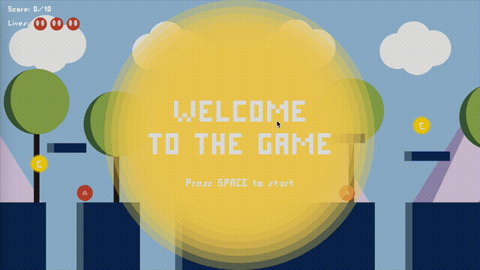

# 🎮 2D Platformer Adventure Game


> My first coding project - A pixel-style 2D platformer game built with p5.js for my Introduction to Programming course at University of London.

## 🌟 About This Project

This is my very first programming project, created as part of the CM1005 Introduction to Programming I course. As a complete beginner to coding, this project represents my journey from knowing nothing about programming to building a fully functional game!

## 🎮 Game Demo



_Welcome screen of the 2D Platformer Adventure Game featuring custom pixel font and retro-style graphics_

## �🎯 Game Features

- **🏃‍♂️ Character Movement**: Smooth left/right movement with jumping mechanics
- **🏗️ Dynamic Platforms**: Moving platforms that add challenge to navigation
- **👾 Enemy System**: Patrolling enemies with collision detection
- **💰 Collectible Items**: 10 coins scattered throughout the level to collect
- **🕳️ Canyon Hazards**: Dangerous gaps that end the game if fallen into
- **🏁 Victory Condition**: Reach the flagpole to win the game
- **❤️ Lives System**: 3 lives to complete the challenge
- **🎵 Sound Effects**: Audio feedback for jumps, collecting items, and game events
- **🎨 Custom Font**: Retro pixel-style typography

## 🎮 How to Play

- **A** or **Left Arrow**: Move left
- **D** or **Right Arrow**: Move right
- **Space**: Jump (when on ground or platform) / Start game / Restart game
- **Objective**: Collect all 10 coins and reach the flagpole while avoiding enemies and canyons!

## 🚀 Getting Started

1. Open the project folder in VS Code
2. Install the "Live Server" extension if you haven't already
3. Right-click on index.html and select "Open with Live Server"
4. The game will open in your browser automatically

## 🛠️ Technical Implementation

### Core Technologies

- **p5.js**: Main game framework for graphics and interaction
- **p5.sound**: Audio library for sound effects
- **HTML5 Canvas**: Rendering engine

### Key Programming Concepts Applied

- **Object-Oriented Programming**: Constructor functions and classes for platforms and enemies
- **Collision Detection**: Custom algorithms for platform contacts and enemy interactions
- **Game State Management**: Lives system, game over/win conditions
- **Factory Pattern**: Used for creating platform objects
- **Scrolling Background**: Infinite scrolling world implementation

### Project Structure

```
├── index.html          # Main HTML file
├── sketch.js           # Core game logic (654 lines!)
├── p5.min.js          # p5.js library
├── p5.sound.min.js    # p5.js sound library
├── Fonts/             # Custom pixel font
└── Sounds/            # Game audio files
```

## 🎨 Assets & Credits

- **Sound Effects**: [Mixkit](https://mixkit.co/) - Licensed under Mixkit Sound Effects Free License
- **Font**: Pixel Millennium v1.00 by Zdenek Gromnica (FutureMillennium) - Licensed under CC BY-NC-ND 3.0
- **Code**: Original implementation by Yue Wu

## 🎓 Learning Journey

This project taught me fundamental programming concepts including:

- **Variables & Data Types**: Managing game state and character properties
- **Arrays & Objects**: Organizing game elements like platforms, enemies, and collectibles
- **Functions**: Breaking down complex game logic into manageable pieces
- **Constructor Functions**: Creating reusable templates for game objects
- **Debugging**: Problem-solving and code troubleshooting techniques
- **Attention to Detail**: The importance of precision in programming

### Challenges Overcome

- Understanding the factory pattern for object creation
- Managing large codebases and navigation through extensive files
- Implementing collision detection systems
- Coordinating multiple game systems (movement, platforms, enemies, score)

## 🏆 Course Information

**Course**: CM1005 - Introduction to Programming I  
**Institution**: University of London  
**Academic Year**: First Year Undergraduate  
**Final Project Status**: ✅ Completed

## 🔗 Connect With Me

[](https://www.linkedin.com/in/yuewuxd/)

---

_This project represents my first steps into the world of programming. While it may seem simple to experienced developers, it represents countless hours of learning, debugging, and problem-solving. I'm proud of what I've accomplished and excited for the coding journey ahead!_ 🚀
